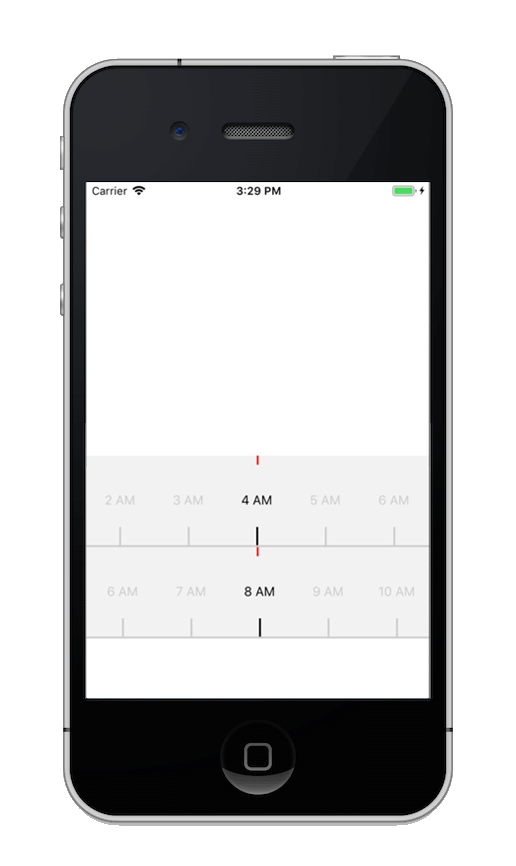

# react-native-wui

### 开始使用
```html
npm install react-native-wui --save
```

### 组件示例

#### 时间选择组件


``` html
import React from 'react
import { Wdatepicker } from 'react-native-wui'

class Wui extends React.Component{
  constructor(){
    super()
    this.state={

    }
  }

  render(){
    return(
      <Wdatepicker />
    )
  }
}

export default Wui
```

#### 时间滑块组件



``` html
import React from 'react
import { WtimeSelect } from 'react-native-wui'

class Wui extends React.Component{
  constructor(){
    super()
    this.state={

    }
  }

  render(){
    return(
      <WtimeSelect />
    )
  }
}

export default Wui
```

#### 分类简介组件


``` html
import React from 'react
import { Whelp } from 'react-native-wui'

class Wui extends React.Component{
  constructor(){
    super()
    this.state={

    }
  }

  render(){
    return(
      <Whelp />
    )
  }
}

export default Wui
```

### 文档地址
```html
http://111.230.57.206
```
